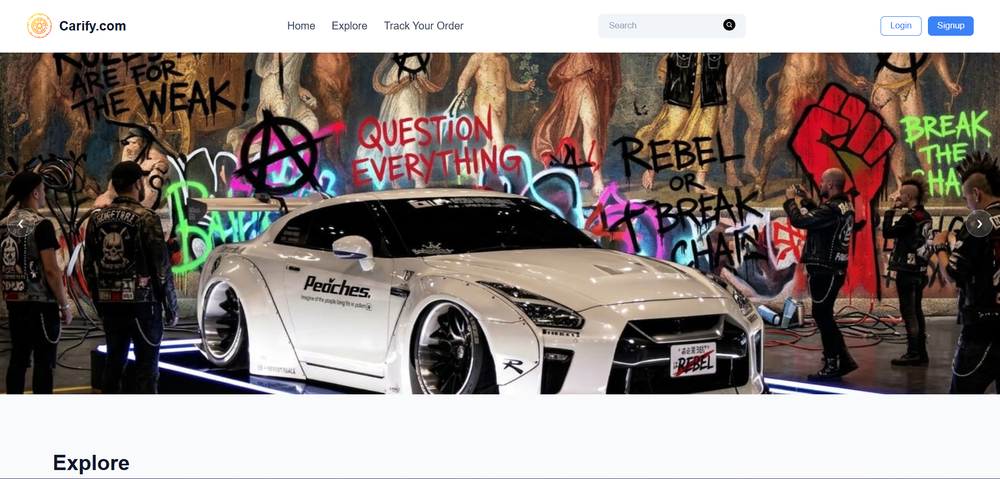

<div>
<p align="center">  </p>
    <h1 align ="center">Carify</h1></p>
</div>

<p align="center">     </p>


Carify is a modern front-end e-commerce web application built using React. It provides a clean user interface for browsing cars, viewing details, and simulating order tracking. The project focuses on responsive design, smooth navigation, and optimized performance.

---

## Features

* Responsive and modern user interface
* Explore section with dynamic car cards
* Hero image slider with smooth transitions
* Track Your Order page with clean empty-state UI
* Navigation using React Router
* Optimized images for fast loading
* Modular component-based architecture

---

## Tech Stack

* React (Functional Components and Hooks)
* React Router DOM (Client-side routing)
* CSS (Custom styling, responsive design)
* Vite (Build tool and development server)

---

## Project Structure

```
Carify/
│
├── public/
│   └── logo.png
│
├── src/
│   ├── assets/
│   ├── components/
│   │   ├── Navbar.jsx
│   │   ├── HeroSlider.jsx
│   │   ├── Explore.jsx
│   │   ├── TrackOrder.jsx
│   │   └── About.jsx
│   │
│   ├── App.jsx
│   ├── main.jsx
│   └── index.css
│
├── package.json
└── README.md
```

---


## Deployment

This project is deployed using platform :

* Vercel
---

---

## License

This project is created for learning and demonstration purposes.
